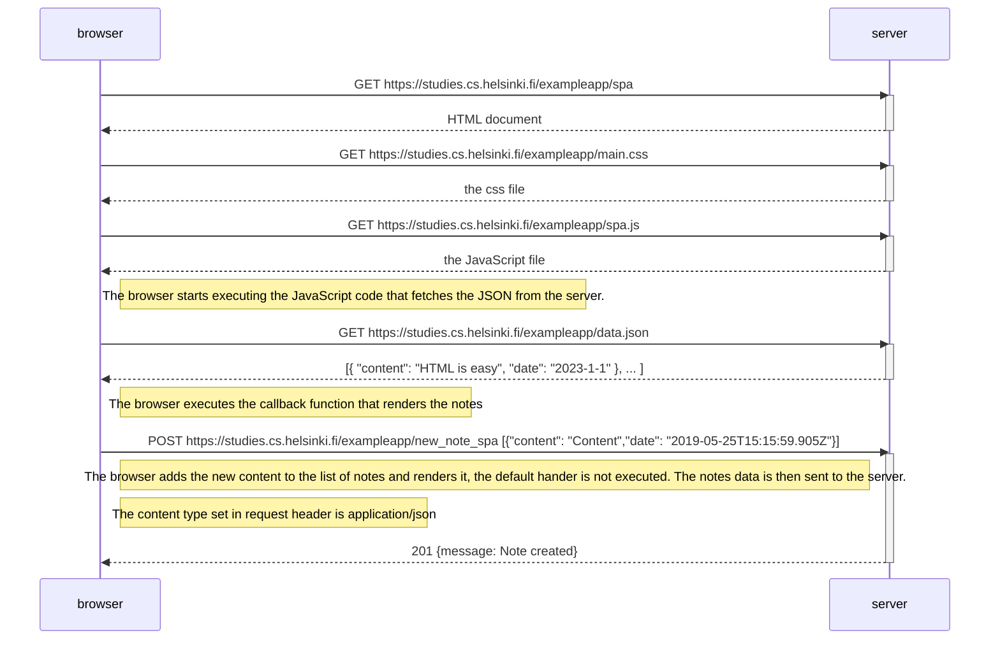

```mermaid

sequenceDiagram
    participant browser
    participant server

    browser ->> server : GET https://studies.cs.helsinki.fi/exampleapp/spa
    activate server
    server -->> browser : HTML document 
    deactivate server

    browser->>server: GET https://studies.cs.helsinki.fi/exampleapp/main.css
    activate server
    server-->>browser: the css file
    deactivate server

    browser->>server: GET https://studies.cs.helsinki.fi/exampleapp/spa.js
    activate server
    server-->>browser: the JavaScript file
    deactivate server

    Note right of browser: The browser starts executing the JavaScript code that fetches the JSON from the server.

    browser->>server: GET https://studies.cs.helsinki.fi/exampleapp/data.json
    activate server
    server-->>browser: [{ "content": "HTML is easy", "date": "2023-1-1" }, ... ]
    deactivate server

    Note right of browser: The browser executes the callback function that renders the notes

    browser ->> server : POST https://studies.cs.helsinki.fi/exampleapp/new_note_spa [{"content": "Content","date": "2019-05-25T15:15:59.905Z"}] 
    activate server
    Note right of browser: The browser adds the new content to the list of notes and renders it, the default hander is not executed. The notes data is then sent to the server. 
    Note right of browser : The content type set in request header is application/json
    server -->> browser :  201  {message: Note created}
    deactivate server


```
